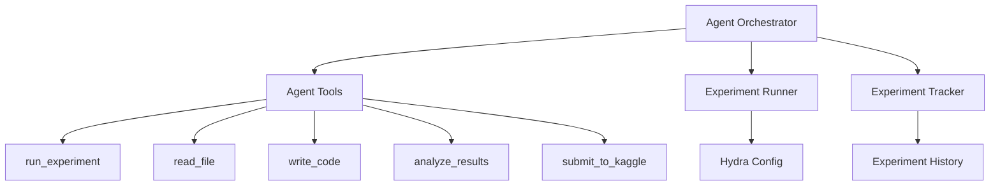

# エージェントアーキテクチャ

## 概要

kautoのエージェントシステムは、Kaggleコンペティションにおいて自律的に実験を計画・実行・分析するための統合フレームワークです。

## アーキテクチャ図



## コンポーネント

### 1. Agent Core (`core/agent/`)

#### `base.py` - BaseAgent
- エージェントの基底クラス
- 状態管理（`state/` ディレクトリ）
- プロンプトテンプレート読み込み

#### `tools.py` - AgentTools
エージェントが使用できるツール群：
- **run_experiment**: 実験スクリプトの実行
- **read_file**: ファイルの読み込み
- **write_code**: コードの書き込み
- **analyze_results**: 実験結果の分析
- **submit_to_kaggle**: Kaggleへの提出

#### `orchestrator.py` - Orchestrator (今後実装予定)
- メイン実験ループ
- 仮説生成 → 実装 → 実験 → 検証 → 報告のサイクル

### 2. Experiment Management (`core/experiment/`)

#### `runner.py` - ExperimentRunner
- Hydra設定を使用した実験実行
- 実行時間とログのキャプチャ
- 設定オーバーライドのサポート

#### `tracker.py` - ExperimentTracker
- 実験履歴の記録（`experiment_history.json`）
- メトリクスの追跡
- 実験の比較

### 3. Configuration Management

Hydraを使用した階層的な設定管理：

```
competitions/[comp]/configs/
├── config.yaml           # 基本設定
├── features/
│   └── basic.yaml        # 特徴量設定
├── models/
│   └── lgbm_default.yaml # モデル設定
└── experiments/
    └── exp001.yaml       # 実験固有設定
```

### 4. Prompts (`prompts/`)

エージェントの動作を定義するプロンプトテンプレート：
- `agent_system.md`: システムプロンプト（役割、ツール、ワークフロー）
- `hypothesis_generation.md`: 仮説生成用テンプレート
- `result_analysis.md`: 結果分析用テンプレート

## データフロー

1. **初期化**
   - エージェントがコンペドキュメントを読み込み
   - 既存の実験履歴を確認

2. **仮説生成**
   - データとドキュメントを分析
   - 改善の仮説を生成

3. **実装**
   - 必要な特徴量/モデルを`src/`に実装
   - 実験スクリプトを`experiments/`に作成

4. **実験実行**
   - ExperimentRunnerが実験を実行
   - ログとメトリクスをキャプチャ

5. **結果分析**
   - ExperimentTrackerが結果を記録
   - エージェントが結果を分析

6. **意思決定**
   - 改善が見られた場合 → 提出を検討
   - 改善が見られない場合 → 新しい仮説を生成

## 状態管理

エージェントの状態は`core/agent/state/[competition]_state.json`に保存：

```json
{
  "iteration": 3,
  "experiments_run": ["exp001_baseline", "exp002_new_feature"],
  "best_score": 0.8372,
  "hypotheses": [...]
}
```

## 実験履歴

実験履歴は`competitions/[comp]/output/experiment_history.json`に保存：

```json
[
  {
    "exp_name": "exp001_baseline",
    "timestamp": "2025-11-27T17:00:00",
    "config": {...},
    "metrics": {"cv_score": 0.8372},
    "success": true,
    "notes": "Baseline experiment"
  }
]
```

## 拡張性

このアーキテクチャは以下の拡張をサポート：
- 新しいツールの追加（`tools.py`に追加）
- 異なるLLMバックエンド（`orchestrator.py`で実装）
- カスタムメトリクス追跡（`tracker.py`を拡張）
- MCP (Model Context Protocol) 統合
